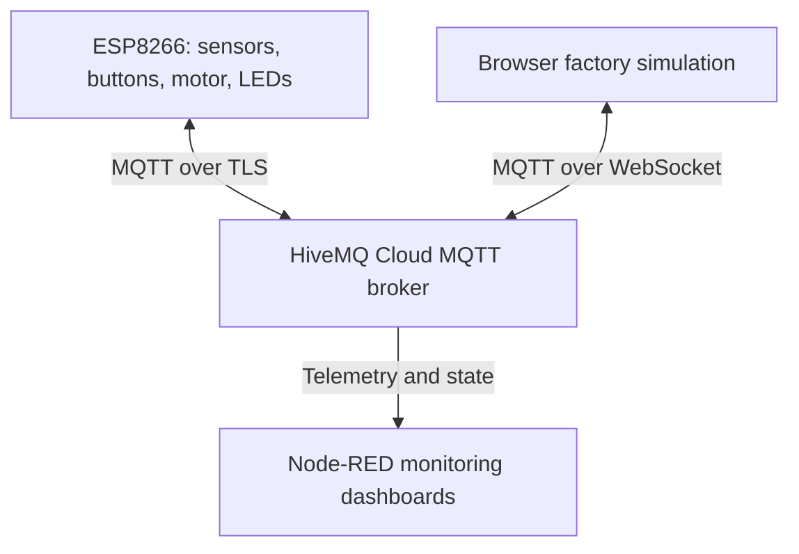
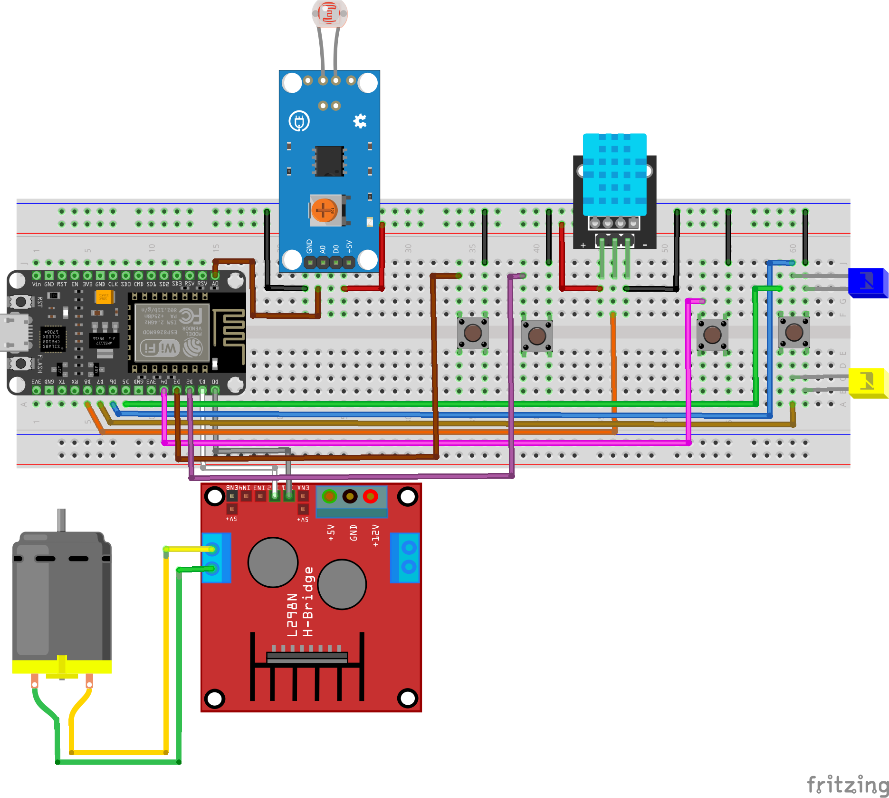
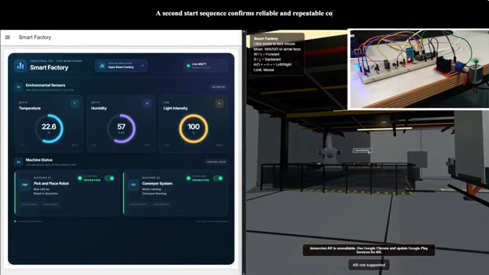
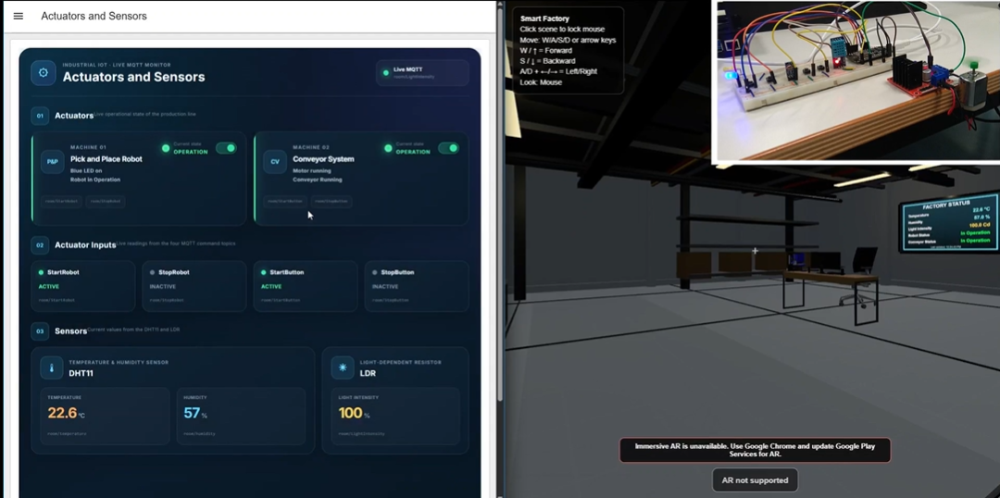
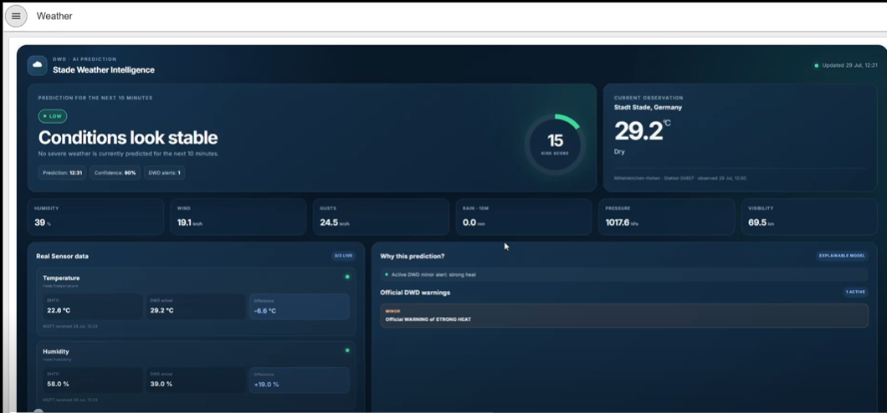

# IIoT Smart Factory

An Industrial Internet of Things project connecting a physical ESP8266 plant to MQTT, Node-RED dashboards, and a browser-based factory simulation. The physical setup reads environmental sensors, handles local controls, drives a DC motor, and indicates robot state with two LEDs.

## System overview

The firmware publishes measurements and button/state events. The browser simulation can publish remote commands to the broker. The supplied Node-RED export subscribes to MQTT messages and displays them; it contains no MQTT output node.

## Hardware

| Component | Purpose |
|---|---|
| NodeMCU ESP8266 | Wi-Fi controller and MQTT client |
| DHT11 | Temperature and humidity |
| LDR module | Light intensity |
| Four push buttons | Local robot and conveyor Start/Stop |
| L298N and DC motor | Conveyor drive |
| Yellow and blue LEDs | Robot operating and idle indication |
| Raspberry Pi 4 | Node-RED host used for the project |

| ESP8266 pin | Connection |
|---|---|
| D0 / D1 | L298N motor inputs |
| D2 / D3 | Conveyor Start / Stop buttons |
| D4 / D5 | Robot Start / Stop buttons |
| D6 / D7 | Yellow robot-on / blue robot-off LEDs |
| D8 | DHT11 |
| A0 | LDR |

The complete editable Fritzing design and a PDF are in [`circuit-design/`](circuit-design/). The detailed pin table, flowcharts, and implementation notes are in the [technical notebook](documentation/IIoT_Smart_Factory_Documentation.ipynb).

## MQTT topics

The firmware publishes the following topics. Temperature, humidity, light intensity, and motor state are sent at a two-second interval; button events are sent when pressed.

| Topic | Value |
|---|---|
| `room/temperature` | Temperature in °C |
| `room/humidity` | Relative humidity in % |
| `room/LightIntensity` | Mapped light level, 0–100 |
| `room/MotorState` | `1` running, `0` stopped |
| `room/StartButton`, `room/StopButton` | Physical conveyor button events |
| `room/StartRobot`, `room/StopRobot` | Robot control events and status |

The firmware subscribes to these active command topics. It accepts `1`, `true`, `on`, `start`, or `pressed` as an active payload.

| Topic | Physical effect |
|---|---|
| `factory/room1/robot/start` | Yellow LED on, blue LED off |
| `factory/room1/robot/stop` | Yellow LED off, blue LED on |
| `room/StartButton` | Start the conveyor motor |
| `room/StopButton` | Stop the conveyor motor |

The Node-RED flow also **monitors** `factory/room1/conveyor/start` and `factory/room1/conveyor/stop` to update its dashboard state. It does not translate those messages into commands for the ESP8266. To control the physical conveyor, a remote client must publish to the `room/StartButton` and `room/StopButton` topics used by the firmware.

## Dashboard and project evidence

The Node-RED export has **Smart Factory**, **Actuators and Sensors**, and **Weather** pages. The Weather flow obtains external observations and alerts through the Bright Sky API and compares them with local DHT11 readings. Its ten-minute risk estimate is based on weather variables and alert conditions.

| Smart Factory monitoring | Sensors and actuators | Weather page |
|---|---|---|
|  |  |  |

## Getting started

1. Open [`firmware/ESP8266_Smart_Factory/`](firmware/ESP8266_Smart_Factory/). Copy `secrets.example.h` to `secrets.h` in that folder and fill in your Wi-Fi SSID/password, HiveMQ username/password, and full broker hostname. Keep `secrets.h` local.
2. Install the ESP8266 Arduino board support and the `PubSubClient` and `DHT` libraries. Open `ESP8266_Smart_Factory.ino`, select your NodeMCU ESP8266 board, upload it, and use a Serial Monitor at **115200 baud**.
3. In Node-RED, import [`node-red/Smart_Factory_Flows.json`](node-red/Smart_Factory_Flows.json). Install the dashboard nodes indicated by the import if needed. Edit the seven MQTT broker configurations to use your broker hostname and add authentication locally; the exported hostname is a placeholder and credentials are not included. The configuration uses TLS on port **8883**.
4. Deploy the flows, then open the dashboard to view live messages. The Weather page also needs network access to the external weather API.

The browser simulation's source was not included in the supplied archive. It will be added after its connection settings can be reviewed; the firmware, Node-RED export, circuit design, and technical documentation are provided here.

## Security and implementation notes

- `.gitignore` excludes `secrets.h`, but check every file before manually uploading through GitHub's website. Node-RED stores credentials separately from this flow export; do not commit a Node-RED credentials file.
- The current ESP8266 sketch calls `espClient.setInsecure()`. MQTT traffic uses TLS, but this setting disables server certificate verification. Configure certificate verification before using the code in an untrusted or production environment.
- The ESP8266 D3, D4, and D8 pins affect boot configuration; the attached circuit must allow the correct levels during reset.

## Demonstration video

Watch the IIoT Smart Factory in operation, including the ESP8266 hardware, Node-RED dashboards, and browser simulation.

[▶ Watch the full demonstration on YouTube](https://youtu.be/29-3qCWDQm4)

Click the image or the link to play the video on YouTube.
